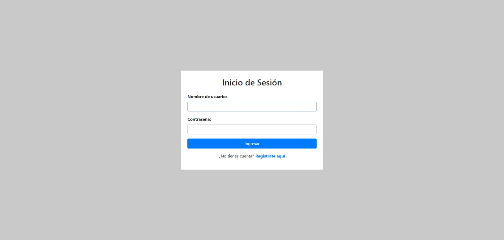

# Sistema de Gestión de Servicios de Salud (NEA)

Plataforma web integral diseñada para la digitalización, automatización y optimización de los flujos de trabajo médicos dentro del **Núcleo de Especialización (NEA) de CANTV**. Este sistema centraliza la gestión de pacientes, el control de citas médicas y la administración de personal, garantizando seguridad y eficiencia operativa.

Este proyecto fue diseñado y desarrollado en colaboración por: **Darwin Colmenares** & **Yannis Iturriago**.

---

## 📸 Vista Previa del Sistema

| Módulo de Autenticación | Gestión de Usuarios y Roles |
|---|---|
|  |  |

| Control de Citas Médicas | Seguimiento de Visitas |
|---|---|
|  |  |

| Sitio Administrativo | Gestión de Empleados |
|---|---|
|  |  |

---

## 🛠️ Stack Tecnológico

* **Backend:** Python 3.12+ / Django 5.1.6.
* **Gestión de Base de Datos:** Configuración híbrida compatible con **PostgreSQL** (producción) y **SQLite** (desarrollo/portabilidad).
* **Seguridad y Acceso:** Implementación de un modelo de usuarios personalizados (`CustomUser`) con arquitectura **RBAC** (Role-Based Access Control) para manejar permisos granulados (Administrador, Médico, Recepción).
* **Frontend:** Interfaz dinámica basada en Django Templates, Bootstrap y CSS personalizado, optimizada para la gestión de datos masivos.
* **Lógica de Negocio:** Validaciones avanzadas mediante expresiones regulares (RegEx) para asegurar la integridad de datos críticos (Cédulas, Teléfonos, Nombres).

---

## ⚙️ Características Principales

* **Control de Acceso por Roles:** Diferenciación visual y funcional de la plataforma según el perfil del usuario logueado.
* **Gestión de Citas Médicas:** Flujo de trabajo para la asignación, seguimiento y diagnóstico de pacientes.
* **Panel Administrativo Personalizado:** Configuración del Administrador de Django para la supervisión técnica de la base de datos.
* **Modularidad:** Código estructurado en aplicaciones independientes para facilitar el escalamiento y mantenimiento.

---

## 🚀 Instalación y Ejecución Local

Para visualizar el proyecto en un entorno local, siga estos pasos:

1. **Clonar el repositorio:**
   ```bash
   git clone [https://github.com/darwinjcn/sistema_salud.git](https://github.com/darwinjcn/sistema_salud.git)
   cd sistema_salud

2. **Configurar el entorno virtual:**
```bash
   python -m venv venv
   # Activar en Windows:
   .\venv\Scripts\activate
   # Activar en Mac/Linux:
   source venv/bin/activate

3. **Instalar dependencias:**
```bash
   pip install -r requirements.txt

4. **Inicializar la Base de Datos Local (SQLite):**
```bash
   python manage.py migrate
   python manage.py loaddata roles.json permisos.json mis_usuarios.json

5. **Lanzar la aplicación:**
```bash
   python manage.py runserver

Acceda a través de su navegador en: http://127.0.0.1:8000/


👤 Créditos y Autoría
Desarrollo y arquitectura ejecutados por:

Darwin Colmenares - GitHub Profile

Yannis Iturriago

Este proyecto representa una solución técnica profesional orientada a la mejora de servicios institucionales de salud pública, enfocada en la robustez del código y la experiencia de usuario administrativa.